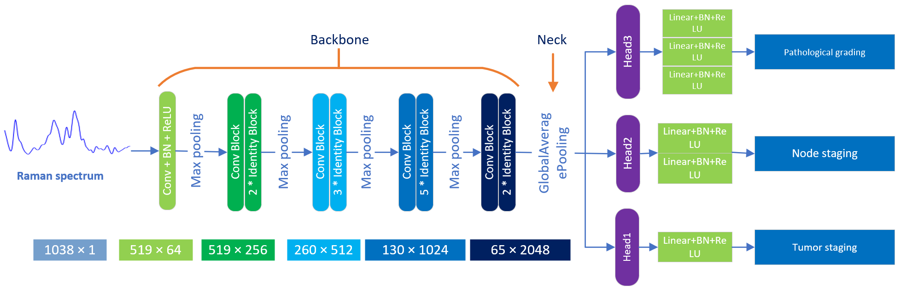
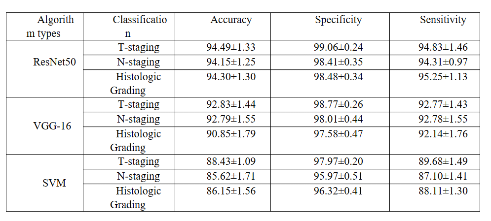

# Multi-RamanSystem
## Introduction
The aim of this study is to achieve multi-task classification through one-dimensional neural network models with modified ResNet50 and VGG architectures to accurately diagnose TNM staging and pathological classification of tumor patients.
Our model is able to extract shared Raman spectral features and realize multi-task diagnosis of T staging, N staging and pathological typing simultaneously, thus providing accurate diagnostic information for individualized treatment of cancer patients.

## Models
In our model, we modify the model into three components: Backbone, Neck, and Head. Backbone performs feature extraction, Neck performs global pooling, and Head implements multi-task classification.
The backbone, neck, and head components are implemented separately in our classifiers module and the corresponding ResNet50 model plots are shown below.

ResNet50 network model:

### Backbone
Backbone includes ResNet50 and VGG, and users load the corresponding models through configuration files

Supported backbone network

- [x] [ResNet](https://github.com/LLY-Bistu/MultiRamanSystem/models/backbones/resnet50.py)
- [x] [VGG](https://github.com/LLY-Bistu/MultiRamanSystem/models/backbones/vgg.py)

### Neck
Neck is mainly Global Average Pooling.

Neck network of support

- [x] [Global Average Pooling](https://github.com/LLY-Bistu/MultiRamanSystem/models/necks/gap.py)

### Head
MultiTaskLinearClsHead is mainly used to implement multitask classification in Head, which implements 7 classification, 5 classification and 5 classification respectively. Meanwhile, the corresponding Loss is integrated in the Head.

Supported classification headers

- [x] [ClsHead](https://github.com/LLY-Bistu/MultiRamanSystem/models/heads/cls_head.py)
- [x] [MultiLinearHead](https://github.com/LLY-Bistu/MultiRamanSystem/models/heads/multi_task_linear_head.py)

## Result
The corresponding results of the modified multi-output network model based on ResNet50 and VGG are shown in the following figure:

